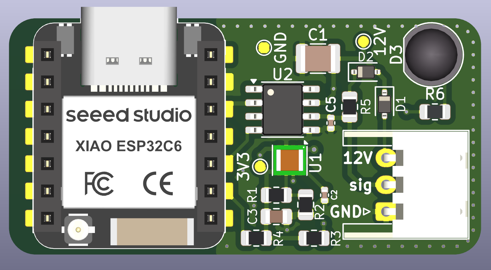
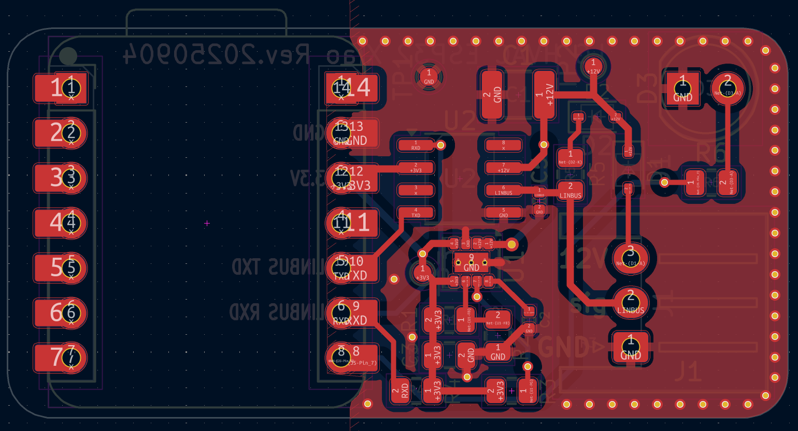
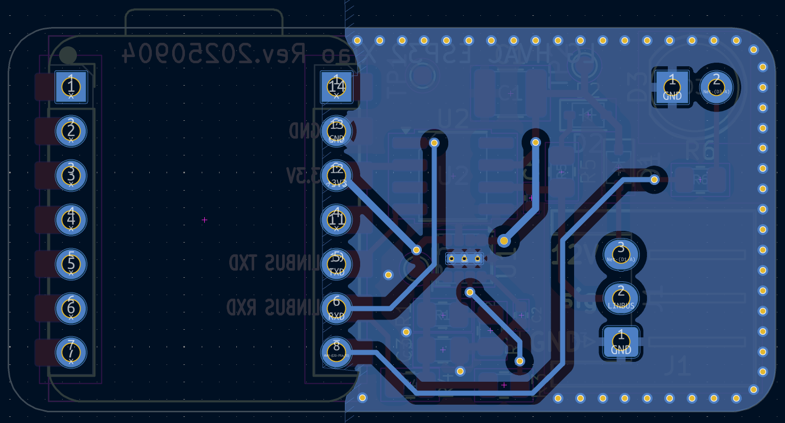

# Seeed Xiao ESP32-C6 PCB Design

This version is for [Seeed Xiao ESP32-C6](https://wiki.seeedstudio.com/xiao_esp32c6_getting_started/), based on the `FeatherS3` revision.

PCB design by [@IreuN](https://github.com/ireun).

> **Note:** This design is untested and has never been produced. It is provided as-is, without any kind of warranty.

# Images

